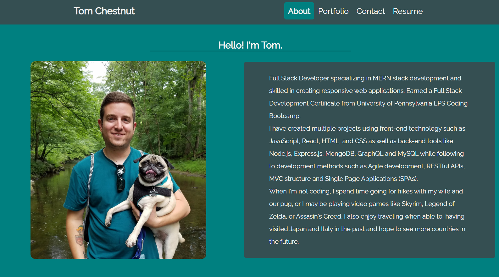
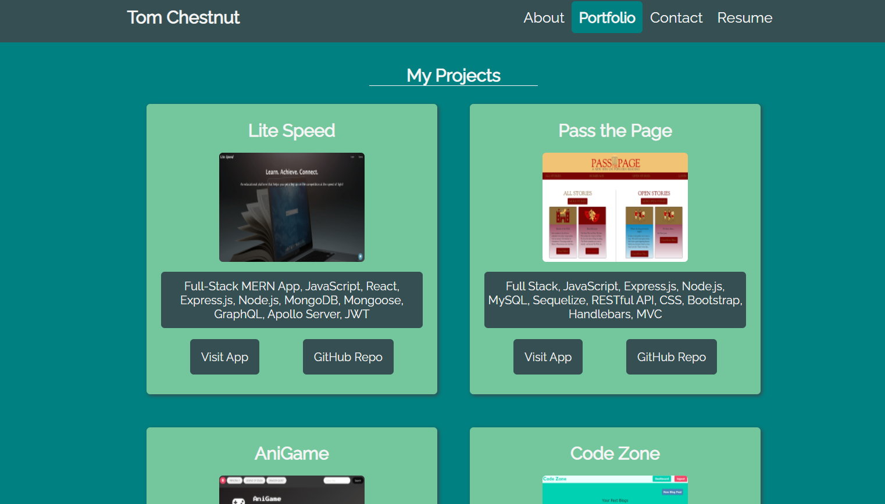
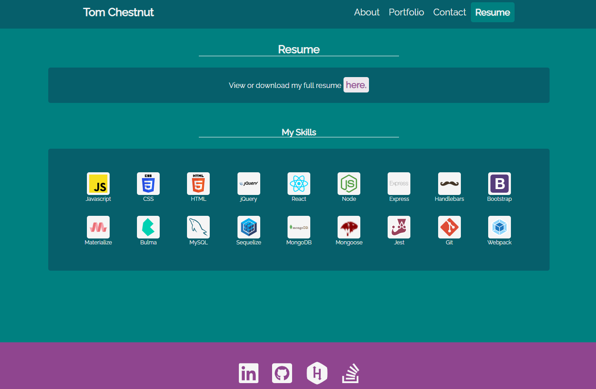

# My Portfolio
 

## Description
 This is my personal portfolio displaying projects I've created, my skills, a link to my resume  and a contact form to get in touch with me. There are also links to some of my social media profiles including LinkedIn, GitHub and others.
 This portfolio is a single-page-application (SPA) that was created using React. CSS features such as flexbox and grid were used, and [FontAwesome for React](https://fontawesome.com/how-to-use/on-the-web/using-with/react) React component library was also used for brand icons of links to my social media accounts.

#### "About Me" Section:

#### "Portfolio" Section with my Projects:

 #### "Resume" Section:
 

  ## Table of Contents
  - [Tech Used](#tech-used)
  - [Contact](#contact)
  - [Links](#links)
  - [License](#license)
  
  ## Technology Used
  
    
  
  
  

  
  ## Contact
  Please visit my **[GitHub profile](https://github.com/tchestnut85/)** to check out this and other projects I've created and contributed to.
  Contact me at **thomaschestnut00@gmail.com** with any questions or if you'd like to collaborate.

  ## Links
  - **[Deployed App](https://tchestnut85.github.io/react-portfolio/)**
  - **[GitHub Repo](https://github.com/tchestnut85/react-portfolio)**
  - **[My Portfolio](https://tchestnut85.github.io/react-portfolio)**
  - **[Connect on LinkedIn](https://www.linkedin.com/in/thomas-chestnut)**

  ## Credits
  - **[React](https://reactjs.org/)**
  - **[FontAwesome for React](https://fontawesome.com/how-to-use/on-the-web/using-with/react)**